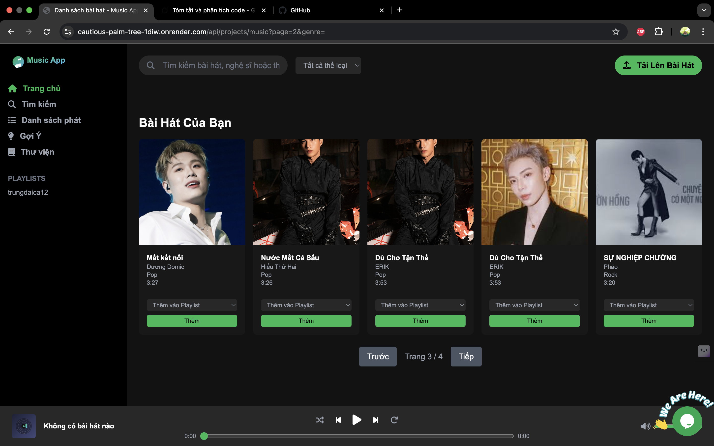
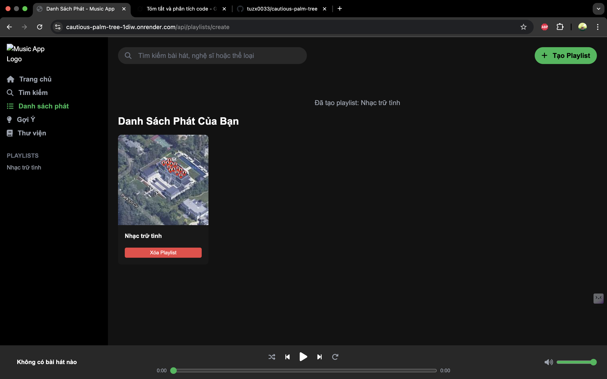
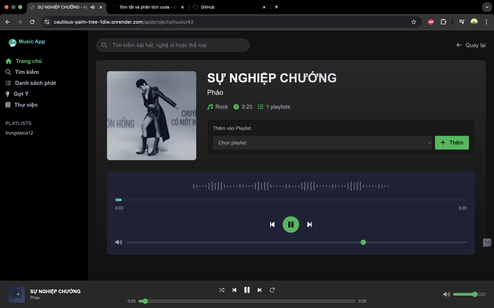

## Music App

### Tổng quan
Music App là một ứng dụng web quản lý và phát nhạc được xây dựng bằng **Spring Boot** và **Thymeleaf**. Ứng dụng cho phép người dùng tải lên, quản lý bài hát, tạo playlist, bình luận, và nhận gợi ý bài hát. Dữ liệu âm thanh được lưu trữ trên **Supabase Storage**, cơ sở dữ liệu sử dụng **PostgreSQL**.

### Tính năng chính
- **Quản lý bài hát**: Tải lên, tìm kiếm, lọc, xóa, và chỉnh sửa bài hát.
- **Playlist**: Tạo, xóa, thêm/xóa bài hát, và xem chi tiết playlist.
- **Bình luận**: Thêm và xem bình luận cho bài hát/playlist.
- **Gợi ý**: Đề xuất bài hát ngẫu nhiên hoặc theo từ khóa.
- **Trình phát**: Trình phát tùy chỉnh với visualizer, điều khiển âm lượng, và phím tắt.

### Công nghệ sử dụng
- **Backend**: Spring Boot, Spring Data JPA, JDBC Template
- **Frontend**: Thymeleaf, Tailwind CSS, Font Awesome, JavaScript
- **Cơ sở dữ liệu**: PostgreSQL (Supabase)
- **Lưu trữ file**: Supabase Storage

### Screenshots
| Trang chủ | Danh sách Playlist | Chi tiết Bài hát |
|-----------|--------------------|------------------|
|  |  |  |

### Yêu cầu cài đặt
- Java 17+, Maven, PostgreSQL, Supabase

### Hướng dẫn chạy dự án
1. Clone repo: `git clone https://github.com/tuzx0033/cautious-palm-tree`
2. Cấu hình `application.properties` với Supabase và PostgreSQL.
3. Chạy: `mvn spring-boot:run`
4. Truy cập: `http://localhost:8080/api/projects/music`

